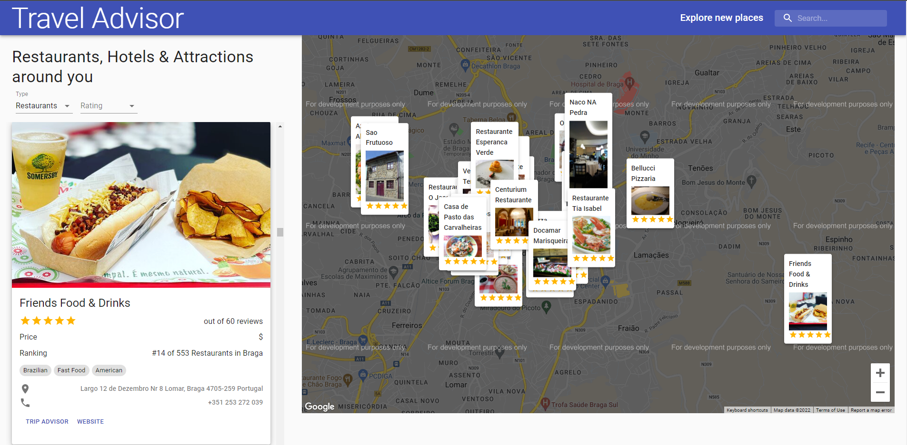

# ReactJS Travel Advisor

A travel advisor webapp for finding restaurants, hotels and attractions near you using google maps with geolocation. 
This app visually places the restaurants, hotels and attractions on the map for the currently visible area. 
It lets the user directly jump to any place on the map by manually searching for it in a google-maps-powered search bar. 
The user can also move around on the map while also adjusting the zoom level to find even more places in the surrounding area through reloading the locations everytime the user moves on the map. 
The app allows the user to further refine their search by providing the ability to filter the locations that are displayed on the map by "type of business" and "average reviews". 
Finally by clicking on any business on the map the user is brought to its detailed information card on the left sidebar where he can find the number of reviews, price level, city ranking, types of food, address, etc and visit the business' website and tripadvisor's page by clicking on the corresponding links that are presented.

This web app was built with:
* ReactJS
* React Hooks
* Axios
* Material UI
* Rapid API
* react-google-maps/api
* google-map-react

Click <a href="https://adtx.github.io/travel_advisor_reactjs/" target="_blank">here</a> to try out the app for yourself.
